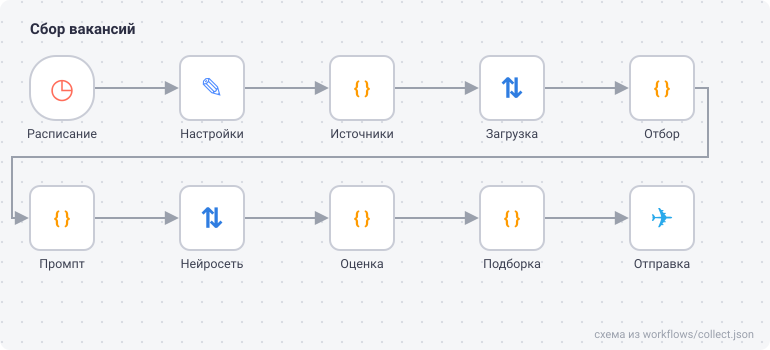

# job-radar

[](https://github.com/maarshir/job-radar/actions/workflows/tests.yml)



<sub>Схема нарисована по файлу конвейера `workflows/collect.json`.</sub>

Листать сайты и десяток каналов с вакансиями каждый день утомляет, а половина объявлений всё равно мимо. job-radar делает это сам: каждые 10 минут собирает новые вакансии, отсеивает лишнее, просит нейросеть оценить каждую под ваш профиль и присылает подходящие в Телеграм по одной, сразу с черновиком сопроводительного письма. Конвейер на n8n.

## Как работает

1. **Сбор.** Открытый API «Работы России», публичные каналы Телеграма, ленты RSS из `src/sources.json`. hh.ru, SuperJob и Хабр Карьера приходят через письма подписок на сохранённые поиски: ветка «Почта» читает их, как только письмо пришло.
2. **Отбор без нейросети.** Свежесть, ключевые и стоп-слова, повторы ссылок и одна и та же вакансия в разных каналах. Правила в `src/filter.config.json`.
3. **Оценка.** Нейросеть читает ваш профиль из `src/profile.md` и вакансию, ставит оценку от 0 до 10, одной фразой объясняет почему и для подходящих пишет сопроводительное письмо.
4. **Отправка.** Каждая вакансия выше порога приходит отдельным сообщением со ссылкой, письмо оформлено блоком кода и копируется одним нажатием.

Каждая вакансия попадает в журнал один раз, у отсеянных записана причина. Сообщение выглядит так (пример):

```
Стажёр Python-разработчик · Пример
удалённо
9/10: Python, боты и FastAPI, опыт не требуется
почта: hh.ru

Сопроводительное письмо:
Здравствуйте! Откликаюсь на стажировку Python-разработчика.
...
```

## Как запустить

Нужны Docker, бот Телеграма и ключ нейросети с интерфейсом OpenAI (подойдёт бесплатный Groq). Пошагово в [docs/setup.md](docs/setup.md).

## Разработка

Код узлов лежит в `src/` обычными файлами, а `npm run build` вклеивает его в `workflows/collect.json`. Так код можно читать, тестировать и сравнивать по коммитам, а не править в окошке n8n. 41 тест (`npm test`) гоняет конвейер целиком на подменённых данных: лента, страница канала, ответ «Работы России» и письмо подписки, без сети. Нужен Node 22.5 или новее.
